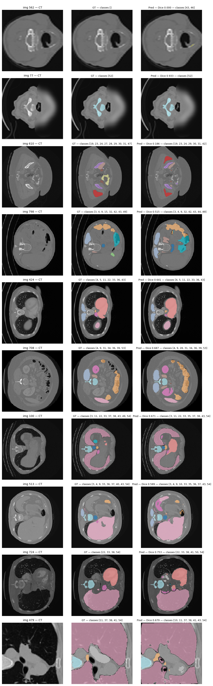
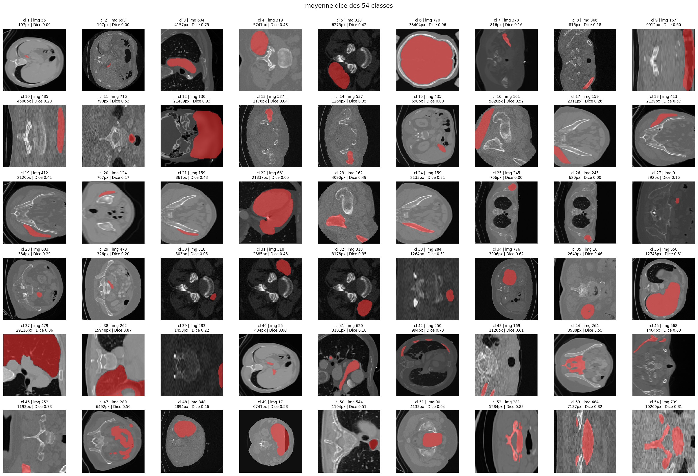

## Lien GitHub

<a class="download-btn" href="github.com/alexandre-p-ml/Challenge-ENS-Data---Raidium" download>📓 Notebook</a>

---

## Description

Challenge ENS Raidium : segmentation sémantique de coupes CT abdominales
256×256, à 55 classes (1 fond + 54 organes et structures anatomiques). La
difficulté centrale n'est pas l'architecture mais la nature des annotations.

- 2000 images d'entraînement, dont seulement 800 annotées et 1200 sans
  rien.
- Annotations partielles : pour chaque image, seul un sous-ensemble de
  classes est certifié. Les autres ne sont ni positives ni négatives, elles
  doivent être ignorées dans la perte.
- ≈90 % des pixels appartiennent au fond et
  plusieurs classes n'apparaissent que dans dix images ou moins.
- 500 images de test évaluées par une Dice macro sur la plateforme.

{fig-align="center" width="100%"}

---

## Stratégie & Résultats

L'approche a consisté à empiler des techniques modestes mais bien ciblées,
en diagnostiquant systématiquement avant d'agir. Score plateforme à chaque
étape retenue :

| Étape | Méthode | Plateforme | Gain |
|---|---|---:|---:|
| Baseline | U-Net ResNet-18, entropie croisée | 0,022 | — |
| Loss masquée | + Dice composé + pondération classes | 0,169 | ×7,7 |
| Consolidation | + augmentations + Dice corrigé + 60 epochs | 0,270 | +0,101 |
| Semi-supervisé | + Mean Teacher (1200 non annotées) | 0,329 | +0,059 |
| Latent | + SupCon contrastive | 0,385 | +0,056 |
| Inférence | + TTA (augmentation au test) | 0,4005 | +0,016 |
| Ciblage | + pondération par classe | 0,4023 | +0,002 |

La loss masquée : en n'appliquant la perte qu'aux classes
certifiées (logits des autres forcés à $-\infty$ avant softmax), le score
saute de 0,022 à 0,169.

Exploiter les 1200 images non annotées — Mean Teacher. Un schéma
semi-supervisé (réseau élève + enseignant en moyenne mobile exponentielle,
perte de cohérence sur les images sans label) porte le score à 0,329.

Diagnostiquer l'espace latent — SupCon. Une ACP de l'avant-dernière couche
(score de silhouette ≈ 0,37) a montré que les classes ratées se concentraient
au centre dense de la projection. Deux régularisations envisagées :
[**SIGReg**](https://arxiv.org/abs/2511.08544) (issue du framework LeJEPA) et
une perte contrastive supervisée (SupCon). Le diagnostic a fait pencher
pour SupCon car plus directe pour écarter les amas. Score porté à 0,385.
Un fait surprenant : la silhouette a baissé (0,37 → 0,25) pendant que le Dice
montait, naïvemen je n'avaist pas prévu cette évolution entre les métriques.

Gain quasi gratuit — TTA. Prédiction de chaque image et de ses trois
retournements, dé-augmentation exacte (involutive), moyennage des softmax :
0,4005 sans réentraînement.

Plafond -
≈ 0,67 en validation locale pour 0,40 plateforme. En fait la
plateforme évalue un Dice macro global non masqué : chaque classe pèse
identiquement ($1/54 \approx 0,019$), une classe à zéro coûte mécaniquement ce
montant quelle que soit sa rareté. La métrique locale masquée surestimait d'un
facteur ≈ 1,8 et j'optimisais en partie la mauvaise grandeur.

Piste tentée - L'étape suivante visait
[**nnU-Net v2**](https://github.com/MIC-DKFZ/nnUNet), référence de la
segmentation médicale en préparation de DinoUNet (fondé sur DINOv3).

### Lecture statistique par classe

{fig-align="center" width="100%"}

Les chiffres extraits éclairent précisément le plafond :

- Dice moyen par classe ≈ 0,43 (médiane 0,47, écart-type 0,28) — très proche
  du score plateforme, cohérent avec un macro-average par classe.
- 6 classes à Dice exactement nul (cl 1, 2, 15, 25, 26, 40) et 9 autres sous
  0,10. Ces 15 classes retranchent à elles seules 0,15 à 0,20 au
  macro-average.
- 11 classes excellentes (Dice ≥ 0,70), jusqu'à 0,96 pour la mieux
  segmentée.
- Corrélation taille/Dice de Pearson ≈ 0,64. Les 5 plus grosses structures
  atteignent un Dice moyen de 0,85, les 5 plus petites seulement 0,11.

---

## Echecs

::: {.callout-warning}
## DINOv2 gelé (ViT-S/14) → échec
Exploiter un Vision Transformer auto-supervisé sur 142 M d'images semblait
prometteur. Résultat : plafond à ≈ 0,40 en validation locale, contre 0,67
pour le pipeline ResNet-18 sur la même validation.
Trois causes probables :

- Décalage de domaine majeur : [DINOv2](https://arxiv.org/abs/2304.07193)
  est entraîné sur des photos naturelles, sans rapport avec les coupes scanner
  en niveaux de gris.
- Backbone gelé : 21 M de paramètres non adaptables donc le décodeur seul ne
  peut pas combler l'écart.
- Résolution grossière (grille 18×18 patches) inadaptée aux contours fins
  d'organes et absence du biais inductif local des convolutions.
:::

::: {.callout-warning}
## MiT-B2 / SegFormer dégelé → échec
Encodeur hybride convolution-transformer, multi-échelle, cette fois dégelé.
Plafond à ≈ 0,495 local, encore loin des 0,672 du ResNet-18. Les
Transformers sont plus dépendants du volume de pré-entraînement que les
CNN et le décalage ImageNet → CT médical n'est pas rattrapable sur seulement
800 images. La capacité supplémentaire (≈ 30 M de paramètres) s'est retournée
en désavantage faute de données.
:::

::: {.callout-warning}
## nnU-Net en local → bloqué par le matériel
Sur une RTX 3050 6 Go. La préparation a réussi
(conversion, manifeste, split imposé comme premier fold), mais l'entraînement
me prenait près d'1 heure par epoch. nnU-Net
auto-configure son budget mémoire au-delà de 6 Go. DinoUNet repose sur la
même infrastructure.
:::

### Remarques

Le point le plus important : les classes à très faible présence sont restées à
Dice nul malgré une pondération forte. La pondération inversement
proportionnelle au Dice par classe a bien amélioré 9 des 12 classes ciblées
(l'une est passée de 0,30 à 0,56), mais le gain plateforme global est resté
faible (+0,0018) — sur 54 classes, chaque amélioration ne pèse que 1,85 %,
et on ne peut pas créer un signal qui n'existe pas avec quelques images
d'entraînement seulement.

